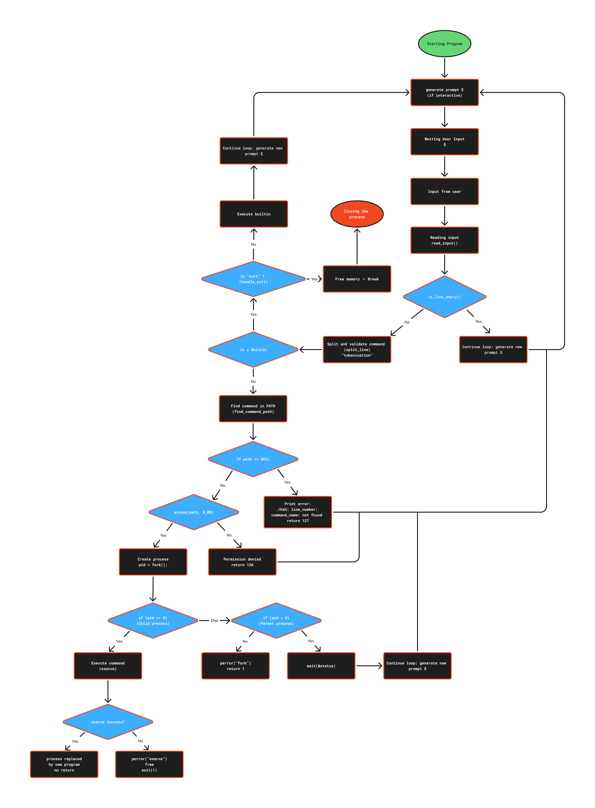

# Simple Shell

> A custom Unix command-line interpreter written in C

## Welcome to the Simple Shell project !

This project is part of my curriculum at Holberton School. It is the second major group project, and also the final project of the first trimester.
Carried out in collaboration with two other students, the goal was to build our own Unix command-line interpreter, called Simple Shell.
The work had to follow strict technical guidelines, including rules on coding style, modularity, and performance. All the requirements and constraints are detailed in the following sections of this README.

## Navigation

- [Technical requirements and constraints](#technical-requirements-and-constraints)
- [Description of Simple Shell](#description-of-simple-shell)
- [The man page](#the-man-page)
- [The Flowchart of Simple Shell](#the-flowchart-of-simple-shell)
- [File organisation](#file-organisation)
- [Main Functions & Return Values](#main-functions--return-values)
- [Memory Leak Testing with Valgrind](#memory-leak-testing-with-valgrind)
- [Tests](#tests)
- [Examples](#examples)
- [How to contribute](#-how-to-contribute)
- [Authors](#authors)

## Technical requirements and constraints

- Allowed editors: vi, vim, emacs
- All your files will be compiled on Ubuntu 20.04 LTS using gcc, using the options -Wall -Werror -Wextra -pedantic -std=gnu89
- All your files should end with a new line
- A README.md file, at the root of the folder of the project is mandatory
- Your code should use the Betty style. It will be checked using betty-style.pl and betty-doc.pl
- Your shell should not have any memory leaks
- No more than 5 functions per file
- All your header files should be include guarded
- Use system calls only when you need to (why?)

### Github

There should be one project repository per group. If you clone/fork/whatever a project repository with the same name before the second deadline, you risk a 0% score.

## More Info

### Output

- Unless specified otherwise, your program must have the exact same output as sh (/bin/sh) as well as the exact same error output.
- The only difference is when you print an error, the name of the program must be equivalent to your argv[0] (See below)  

Example of error with sh:

```c
julien@ubuntu:/# echo "qwerty" | /bin/sh
/bin/sh: 1: qwerty: not found
julien@ubuntu:/# echo "qwerty" | /bin/../bin/sh
/bin/../bin/sh: 1: qwerty: not foun
```

Same error with your program hsh:

```c
julien@ubuntu:/# echo "qwerty" | ./hsh
./hsh: 1: qwerty: not found
julien@ubuntu:/# echo "qwerty" | ./././hsh
./././hsh: 1: qwerty: not found
```

## List of allowed functions and system calls+

```c
all functions from string.h
access (man 2 access)
chdir (man 2 chdir)
close (man 2 close)
closedir (man 3 closedir)
execve (man 2 execve)
exit (man 3 exit)
_exit (man 2 _exit)
fflush (man 3 fflush)
fork (man 2 fork)
free (man 3 free)
getcwd (man 3 getcwd)
getline (man 3 getline)
getpid (man 2 getpid)
isatty (man 3 isatty)
kill (man 2 kill)
malloc (man 3 malloc)
open (man 2 open)
opendir (man 3 opendir)
perror (man 3 perror)
printf (man 3 printf)
fprintf (man 3 fprintf)
vfprintf (man 3 vfprintf)
sprintf (man 3 sprintf)
putchar (man 3 putchar)
read (man 2 read)
readdir (man 3 readdir)
signal (man 2 signal)
stat (__xstat) (man 2 stat)
lstat (__lxstat) (man 2 lstat)
fstat (__fxstat) (man 2 fstat)
strtok (man 3 strtok)
wait (man 2 wait)
waitpid (man 2 waitpid)
wait3 (man 2 wait3)
wait4 (man 2 wait4)
write (man 2 write)
```

### Compilation

- Your code will be compiled this way:

```c
$ gcc -Wall -Werror -Wextra -pedantic -std=gnu89 -Wno-format *.c
```

### Testing

Your shell should work like this in interactive mode:

```c
julien@ubuntu:/# ./hsh
($) /bin/ls
hsh main.c shell.c
($)
($) exit
julien@ubuntu:/#
```

But also in non-interactive mode:

```c
julien@ubuntu:/# echo "/bin/ls" | ./hsh
hsh main.c shell.c test_ls_2
julien@ubuntu:/# cat test_ls_2
/bin/ls
/bin/ls
julien@ubuntu:/# cat test_ls_2 | ./hsh
hsh main.c shell.c test_ls_2
hsh main.c shell.c test_ls_2
julien@ubuntu:/#
```

### Checks

The Checker will be released at the end of the project (1-2 days before the deadline). We strongly encourage the entire class to work together to create a suite of checks covering both regular tests and edge cases for each task. See task `8. Test suite`.

After the deadline, you will need to fork the repository if it’s not on your Github account to be able to be corrected by the checker.

## Description of Simple shell

<p align="right"><a href="#navigation">↑ Back to Navigation</a></p>

The Simple Shell project involves recreating a simplified command interpreter, similar to /bin/sh, in the C language. It is a program that allows the user to execute commands online, just like in a real Linux terminal.

## The man page

<p align="right"><a href="#navigation">↑ Back to Navigation</a></p>

The command to call up the man page: `man ./man_1_simple_shell`


## The Flowchart of Simple Shell

Here is a global diagram of how our custom shell works.
It follows the main execution loop of the shell, distinguishes internal commands (builtins) from external ones, and shows how errors are handled.



<p align="right"><a href="#navigation">↑ Back to Navigation</a></p>

Here is a global diagram of how our custom shell works.
It follows the main execution loop of the shell, distinguishes internal commands (builtins) from external ones, and shows how errors are handled.


## File organisation

<p align="right"><a href="#navigation">↑ Back to Navigation</a></p>

`builtin_utils.c`: Contains the implementation of built-in command handlers such as exit and env.
These functions allow the shell to handle internal commands without invoking external programs.

`core_shell.c`: Implements the core loop of the shell, including prompt display, input reading, tokenizing, and dispatching commands.
It handles both interactive and non-interactive modes.

`env_utils.c`: Provides utility functions for environment variable handling.
Includes a custom implementation of _getenv to fetch environment variable values without using the standard library’s getenv.

`execute_command.c`: Manages the execution of external commands using fork, execve, and wait.
Also responsible for finding the command path and launching child processes when necessary.

`input_utils.c`: Handles input reading and preprocessing.
Includes read_input, split_line, and is_line_empty for basic input preprocessing.

`main.c`: Serves as the official entry point of the program. It contains the `main` function, which delegates execution to the core shell logic by calling `core_shell(argv)`. This structure ensures that the shell behaves correctly even in environments requiring a standard `main()` function.

`main.h`: The main header file for the shell.
Contains all function prototypes, macros, and include guards.
It serves as the central point for shared declarations across all source files.

`string_utils.c` & `string_utils2.c`: Contain helper functions for basic string manipulation.
string_utils.c includes general-purpose utilities used throughout the shell.
string_utils2.c is reserved for optional or bonus string functions, which may be added later depending on project progress.

## Main Functions & Return Values

<p align="right"><a href="#navigation">↑ Back to Navigation</a></p>

- **Function**: `handle_exit(char **args, char *line)`
  - **Description**: Checks whether the user entered the `exit` command. If so, it frees the input line and terminates the shell process.
  - **Returns**: `1` if the shell should terminate, `0` otherwise.

- **Function**: `handle_env(char **args, char *line)`
  - **Description**: Checks whether the user entered the `env` command. If so, prints all the current environment variables to the standard output.
  - **Returns**: `1` if the command was recognized and handled, `0` otherwise.

- **Function**: `handle_builtin(char **args, char *line)`
  - **Description**: Checks if the command entered is a built-in (`env`, `exit`, etc.) and calls the appropriate internal function.
  - **Returns**: `1` if a built-in command was recognized and executed, `0` otherwise.

- **Function**: `main(int argc, char **argv)`
  - **Description**: Entry point of the shell. Runs the main loop that displays the prompt, reads and parses user input, executes commands, and handles memory cleanup.
  - **Returns**: Always `0` (unless forcibly exited by a signal or internal call to `exit()`).

- **Function**: `_getenv(const char *name)`
  - **Description**: Searches for an environment variable by name and returns a pointer to its value (the part after the `=` sign).
  - **Returns**: A pointer to the variable's value if found, or `NULL` if the variable does not exist or if the input is `NULL`.

- **Function**: `find_command_path(char *command)`
  - **Description**: Searches the directories listed in the `PATH` environment variable to find the absolute path of a given command.
  - **Returns**: A newly allocated string containing the full path if the command is found and executable, or `NULL` if not found or if an error occurs.

- **Function**: `execute_command(char **args, char **argv, int line_number, char *line)`
  - **Description**: Handles the execution of a user-entered command. Checks for built-ins, resolves the full path using `PATH`, verifies execution permissions, and initiates the process if valid.
  - **Returns**: `0` if a built-in was executed, `1` to continue the main loop, `127` if the command was not found, or `126` if permission was denied.

- **Function**: `launch_process(char *path, char **args)`
  - **Description**: Forks the current process to execute a command via `execve`. The child process replaces its image with the command, while the parent waits for it to finish.
  - **Returns**: Always `1`, indicating that the shell should continue running (unless explicitly exited elsewhere).

- **Function**: `is_executable(char *path, char **argv, int line_number, char *cmd_name)`
  - **Description**: Checks whether the given path corresponds to a file with executable permissions. If not, it prints a formatted error message using `argv[0]` and the line number.
  - **Returns**: `0` if the file is executable, `126` if permission is denied.

- **Function**: `split_line(char *line)`
  - **Description**: Tokenizes user input into the command and its arguments, using spaces and newline characters as delimiters. Returns a NULL-terminated array of strings compatible with `execve`.
  - **Returns**: A dynamically allocated array of strings (tokens), or `NULL` if memory allocation fails.

- **Function**: `read_input(void)`
  - **Description**: Reads a full line from standard input using `getline`. Automatically allocates memory and resizes the buffer as needed.
  - **Returns**: A pointer to the input string (must be freed by the caller), or `NULL` if end-of-file is reached (Ctrl+D) or an error occurs.

- **Function**: `is_line_empty(const char *line)`
  - **Description**: Checks whether a line is empty or only contains whitespace characters such as spaces, tabs, or newlines.
  - **Returns**: `1` if the line is empty or insignificant, `0` otherwise.

- **Function**: `free_args(char **args)`
  - **Description**: Frees the dynamically allocated array of strings used to store command arguments, if not `NULL`.
  - **Returns**: Nothing (`void` function).


## Memory Leak Testing with Valgrind

<p align="right"><a href="#navigation">↑ Back to Navigation</a></p>

Throughout the development of the Simple Shell project, we consistently used Valgrind to detect and fix memory leaks. Each dynamically allocated memory block (such as user input, tokenized arguments, and command paths) is carefully freed before the program exits or restarts its main loop.

We ran the shell through `valgrind --leak-check=full --show-leak-kinds=all` with a variety of interactive and non-interactive tests, including built-in commands (env, exit), valid and invalid external commands (ls, /bin/ls, unknown commands), and EOF handling (Ctrl+D).

After refining our main, split_line, find_command_path, and execute_command functions, Valgrind confirmed that no memory was definitely lost and no blocks were indirectly or possibly leaked. Only a small still reachable block remained due to the program terminating with exit, which does not impact memory safety.

✔️ Our shell now passes all memory checks with 0 leaks, ensuring robust and secure memory management.

### The script


### script results with memory leaks


### Script result with patched leaks 


## Tests

<p align="right"><a href="#navigation">↑ Back to Navigation</a></p>

Throughout the assembly of our Simple Shell, we conducted targeted tests for each crucial function to ensure reliability and correctness. Functions like _getenv, split_line, read_input, handle_builtin, handle_exit, handle_env, and others were individually tested using dedicated scenarios to validate their behavior in isolation. The test source files themselves were documented through screenshots, showcasing the logic and structure used to verify correctness, edge cases, and memory safety. This methodical approach allowed us to identify bugs early, refine our logic incrementally, and ensure full integration compatibility across the project.

<p align="center">
  
  
</p>

<p align="center">
  
  
</p>

<p align="center">
  
  
</p>

<p align="center">
  
  
</p>

<p align="center">
  
  
</p>

## Examples

<p align="right"><a href="#navigation">↑ Back to Navigation</a></p>

Here is a simple usage example of our custom shell in interactive mode:

```bash
$ ./hsh
($) ls
README.md  main.c  input_utils.c  hsh  builtins.c
($) echo "Hello, Shell!"
Hello, Shell!
($) /bin/ls
README.md  main.c  input_utils.c  hsh  builtins.c
($) qwerty
./hsh: 1: qwerty: not found
($) env
USER=student
HOME=/home/student
PATH=/usr/local/sbin:/usr/local/bin:/usr/sbin:/usr/bin:/bin
...
($) exit
$
```

> ⚠️ This shell supports both **interactive mode** and **non-interactive mode**:

**Non-interactive mode example:**

```bash
$ echo "ls" | ./hsh
README.md  main.c  input_utils.c  hsh  builtins.c
```

## 🤝 How to Contribute

<p align="right"><a href="#navigation">↑ Back to Navigation</a></p>

Contributions, issues and feature requests are welcome!

If you want to contribute to this project, here’s how we suggest proceeding — based on our collaborative workflow during the development of *Simple Shell*:

### 🛠️ Local Setup

1. **Fork the repository** to your GitHub account.
2. **Clone your fork** locally:

   ```sh
   git clone https://github.com/<your-username>/simple_shell.git
   ```

3. Create a new branch for your changes:

   ```sh
   git checkout -b feature/your-feature-name
   ```

### 🧪 Development Process

- Stick to the Holberton School constraints (Betty style, memory checks, etc).
- Keep functions small (max 5 per file).
- Respect modularity: one responsibility per function/file.
- Document your functions clearly (description + parameters + return).
- Make sure your code compiles with:

  ```sh
  gcc -Wall -Werror -Wextra -pedantic -std=gnu89 *.c -o hsh
  ```

### ✅ Testing

We recommend creating a dedicated test file or using interactive/non-interactive tests as shown in the project examples.  
Make sure your changes do not break existing features.

### 🔄 Pull Request

1. **Commit your changes** clearly:

   ```sh
   git add .
   git commit -m "Add: description of the change"
   git push origin feature/your-feature-name
   ```

2. **Open a Pull Request** from your branch to the `main` branch of the original repo.
3. In your PR description, include:
   - What you changed
   - Why you changed it
   - Any questions or areas you'd like review on

### 🙏 Code Review

Once your PR is open, teammates will review your code. Be open to suggestions!  
Reviews are part of the learning process — don’t hesitate to ask questions.

---

> 🔁 This section is based on our real workflow during the development of *Simple Shell*, where we focused on code quality, communication, and Git best practices.

## Authors

<p align="right"><a href="#navigation">↑ Back to Navigation</a></p>

[Benjamin Estrada](https://github.com/Aluranae)  
[Nawfel](https://github.com/nawfel83)  
[Warren](https://github.com/Warrre)
